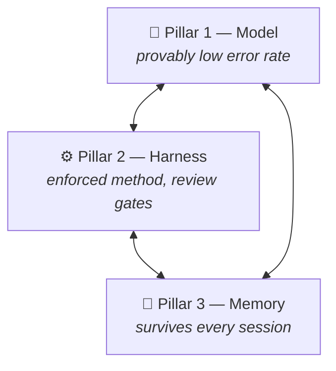

  

  # AI Trinity — an operator's field manual

  **A great model is not enough. This is what makes [Claude](https://claude.com) actually reliable in daily operation — and how to build it yourself.**

  
  
  

  [The Problem](manual/00-problem.md) · [The Thesis](manual/01-thesis.md) · [Pillar 1](manual/pillar-1-model/README.md) · [Pillar 2](manual/pillar-2-harness/README.md) · [Pillar 3](manual/pillar-3-memory/README.md) · [Field Notes](field-notes/README.md) · [Upstream](upstream/README.md)

---

## TL;DR

After months of heavy daily use, one conclusion held up: a brilliant model on its own is a **brilliant amnesiac**. The model is necessary but not sufficient. Three things have to be true at the same time before the quality-of-life jump actually happens:

| Pillar | Problem it solves | Reference |
|--------|-------------------|-----------|
| **[1. A model that is provably not dumb](manual/pillar-1-model/README.md)** | Error rate is the deciding factor, not benchmarks-on-paper. A high-hallucination model poisons everything downstream. | [Claude](https://claude.com) · screened via [bullshit-benchmark](https://github.com/petergpt/bullshit-benchmark) |
| **[2. A disciplined foundation / harness](manual/pillar-2-harness/README.md)** | Raw chat has no method. Skills, sub-agents, hooks, and review gates turn a chatbot into a tool. | [Claude Code](https://claude.com/product/claude-code) + [ECC](https://github.com/affaan-m/ECC) |
| **[3. A persistent brain](manual/pillar-3-memory/README.md)** | Session handoff and compaction are **architecturally lossy** — detail is silently dropped. Without external memory, every new session starts from zero. | [MemPalace](https://github.com/MemPalace/mempalace) |

Miss any one pillar and the system quietly degrades — not loudly, which is exactly the danger. A missing brain wastes your mornings re-explaining. A missing method makes every result a coin flip. A weak model **corrupts the other two from the inside**: it writes confident nonsense into your memory and waves its own work through your review gates. That compounding is why this repo treats the three as one system, not a menu.

## Why Claude, specifically

The thesis is tool-agnostic in principle. The stack behind this manual is not: it has run **exclusively on Claude — Claude Code plus the Claude apps — for months**, and that is a Pillar-1 decision backed by field failures, not brand preference:

- **Local/small models failed the memory test.** An early experiment let a local small-parameter model write to the persistent store. It filled the store with six figures of plausible-sounding noise; the store had to be rebuilt and the pipeline retired. Half-knowledge delivered with full confidence is not a discount — downstream, it is a liability.
- **A competitor failed the validator test.** A second-opinion model used to cross-check deep audits *invented findings* — errors precise enough to look like diligence. A validator that hallucinates is worse than no validator. Dropped.
- **Claude passed both, then carried the load.** Every fix in the [Upstream Ledger](upstream/README.md) — including a merged data-loss fix and a 45s→1.3s protocol fix — was diagnosed, built, tested, and shipped with [Claude Code](https://claude.com/product/claude-code) driving the [method](manual/pillar-2-harness/README.md). The receipts are the argument.

Screen your own model with an objective test ([bullshit-benchmark](https://github.com/petergpt/bullshit-benchmark)) and draw your own conclusion — that is the point of Pillar 1. This operator's screen has a clear winner.

## Battle-tested, not blogged

This is not theory written after a weekend of tinkering. The stack behind this manual runs daily against a 300k-entry memory store on Windows — and the failures it surfaced were diagnosed and **fixed upstream in the pillars themselves**: a merged data-loss fix, a 45s→1.3s MCP handshake fix, a silent-GPU-fallback fix, and more. See the [Upstream Ledger](upstream/README.md) for the receipts and the [Field Notes](field-notes/README.md) for the full worked cases.

## How to read this

1. **[The Problem](manual/00-problem.md)** — why a great model alone leaves you with an amnesiac genius.
2. **[The Thesis](manual/01-thesis.md)** — the three pillars and why all three are mandatory.
3. **The pillars** — one page each: claim, proof from the field, how to build it, how to operate it. [Model](manual/pillar-1-model/README.md) · [Harness](manual/pillar-2-harness/README.md) · [Memory](manual/pillar-3-memory/README.md). Build them in this order.
4. **[Field Conditions: Windows](manual/02-field-conditions-windows.md)** — the honest platform gaps nobody else documents.
5. **[Field Notes](field-notes/README.md)** — worked failure cases, and **[before/after proof](examples/README.md)** that the brain holds.
6. **[Upstream Ledger](upstream/README.md)** — the loop closed: what this setup sent back to its foundations.
7. **[FAQ](manual/03-faq.md)**

## Credits

This is one operator's lived system, standing on three independent open-source projects and one exceptional agent runtime. Full credit to their authors — see [CREDITS](CREDITS.md). This repo contributes the **synthesis, the build path, the field notes — and bug fixes back upstream**.

## License

Documentation licensed under [CC BY 4.0](LICENSE). Maintained by **KeilerHirsch**.
